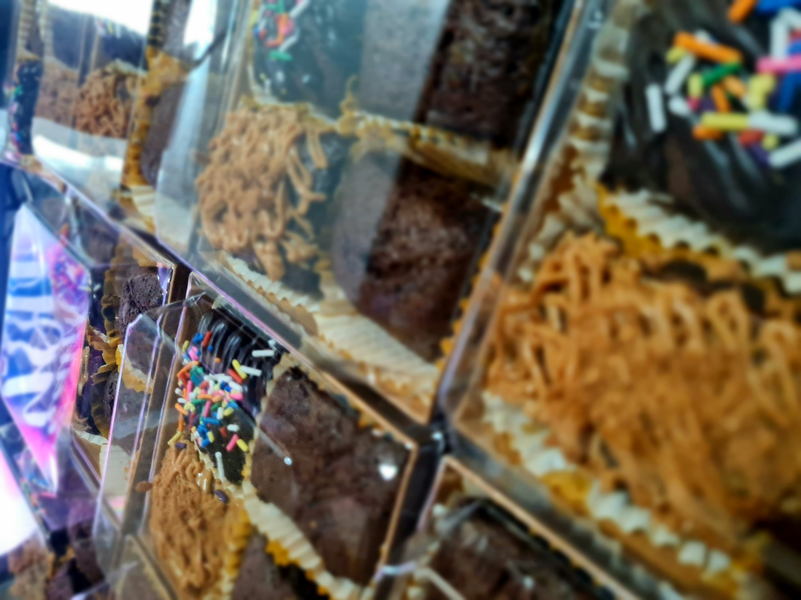

<html lang="en">
<head>
  <meta charset="UTF-8" />
  <meta name="viewport" content="width=device-width, initial-scale=1.0"/>
  <title>Airah Nicolei delos Reyes - Portfolio</title>
  
</head>
<body>

  <header>
    <h1>Airah Nicolei delos Reyes</h1>
    
    
BS Entrepreneurship Student | Baker | Nature Lover | Artist

</header>

  <section id="about">
    <h2>About Me</h2>
    
    
Hello! I’m Airah Nicolei delos Reyes, a first-year BS Entrepreneurship student at Mariano Marcos State University. I’m passionate about learning how to start and manage businesses, and I enjoy taking risks when it comes to exploring new opportunities. I have a strong interest in baking, nature photography, and creating art, which I often combine with my business ideas. I’m a creative and curious individual who loves turning small ideas into meaningful projects. Whether it’s designing a product, capturing nature’s beauty through my camera, or experimenting with new recipes, I always bring enthusiasm and attention to detail. My goal is to keep growing as an entrepreneur while doing the things I love.

  </section>

  <section id="projects">
    <h2>Projects</h2>

    

      <h3>SweetBox Brownie Shop</h3>
      
A simple page I created to showcase my small brownie business. It includes a photo of my homemade brownies and a short description of the different flavors I offer.

      
      
    

    

      <h3>Nature Photography Gallery</h3>
      
A photo gallery that displays some of my favorite nature shots. This project shows my love for nature and photography in a simple and organized layout that looks good on both phones and computers.

      
      
    

  </section>

  <section id="contact">
    <h2>Contact</h2>
    
Email: <a href="mailto:airahnicoleidelosreyes@gmail.com">airahnicoleidelosreyes@gmail.com</a>

    
Phone: 0960-913-9158

  </section>

  <footer>
    
&copy; 2025 Airah Nicolei delos Reyes

  </footer>

</body>
</html>
